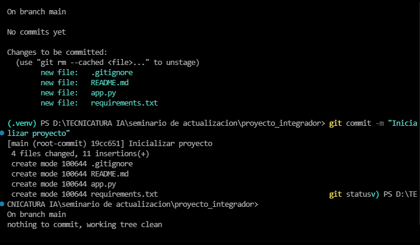

# Portfolio - Proyecto Integrador

Repositorio correspondiente al proyecto integrador de la cursada.

# Clase 02

## Actividad: Laboratorio Clase 2 – Preparación del entorno de desarrollo
Seminario de Actualización · IFTS N.º 18

En esta actividad se preparó el entorno de desarrollo necesario para comenzar con el **Proyecto Integrador**. El objetivo fue verificar que las herramientas principales estuvieran correctamente instaladas y configuradas, crear la estructura inicial del proyecto y dejar preparado el entorno para trabajar con Python y Git.

Durante la actividad se realizaron las siguientes tareas:

- Verificación de la instalación y funcionamiento de **Python, Visual Studio Code y Git**.
- Configuración del nombre de usuario de Git.
- Creación de la carpeta del proyecto y apertura en **Visual Studio Code**.
- Creación y activación de un **entorno virtual `.venv`** para aislar las dependencias del proyecto.
- Instalación de una librería dentro del entorno virtual.
- Generación del archivo `requirements.txt` con las dependencias utilizadas.
- Inicialización del repositorio local mediante `git init`.
- Revisión y configuración del archivo `.gitignore` para evitar versionar archivos innecesarios, especialmente el entorno virtual.
- Creación del primer **commit** para registrar el estado inicial del proyecto.
- Verificación del estado del repositorio mediante `git status`.

Al finalizar, el proyecto quedó con una estructura básica y un entorno de desarrollo preparado para continuar con las siguientes etapas del **Proyecto Integrador**.

## Contenido

### Clase 02
Descripción breve de lo realizado.


````markdown
## Inicialización del repositorio Git

Se inicializó un repositorio Git local para comenzar con el control de versiones del proyecto.

En el primer estado se agregaron al área de preparación (`staging`) los archivos principales del proyecto:

- `.gitignore`: contiene los archivos y carpetas que Git debe ignorar.
- `README.md`: documentación inicial del proyecto.
- `app.py`: archivo principal de la aplicación.
- `requirements.txt`: contiene las dependencias necesarias para ejecutar el proyecto.

### Primer commit

Luego se realizó el primer commit mediante el siguiente comando:

```bash
git commit -m "Inicializar proyecto"
````

Git confirmó la creación del commit:

```text
[main (root-commit) 19cc651] Inicializar proyecto
4 files changed, 11 insertions(+)
```

El término `root-commit` indica que este es el **primer commit del repositorio**, es decir, el punto inicial del historial de versiones.

### Verificación del estado del repositorio

Finalmente, se ejecutó:

```bash
git status
```

Git informó:

```text
On branch main
nothing to commit, working tree clean
```

Esto significa que:

* Se está trabajando sobre la rama `main`.
* No existen cambios pendientes de guardar.
* Todos los archivos agregados ya forman parte del commit.
* El árbol de trabajo (`working tree`) se encuentra limpio.

### Estado final

El repositorio Git quedó **inicializado correctamente**, con su primer commit creado y sin cambios pendientes.
El proyecto esta subido a GitHub.

```
```

## Autor/a

Gabriela Coronel