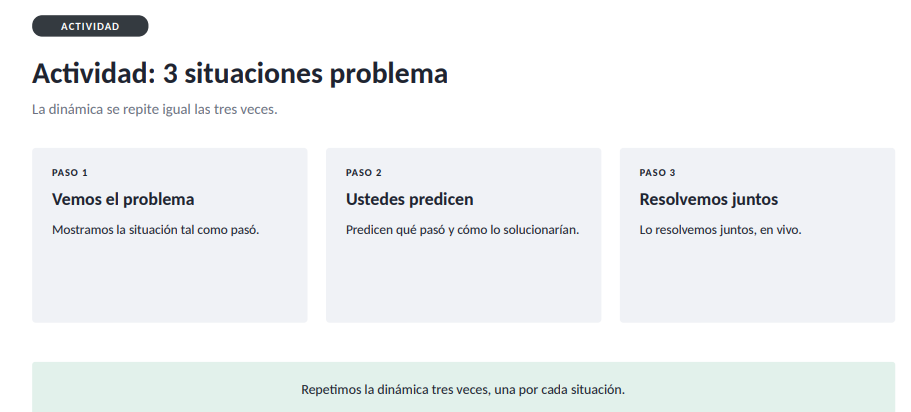

# Portfolio - Proyecto Integrador

### Clase 03: GitHub, Codespaces y control de versiones
Seminario de Actualización · IFTS N.º 18


## Contenido



# Práctica: Situaciones prácticas de Git y GitHub

## Introducción

En esta actividad se analizan tres situaciones frecuentes al trabajar con **Git** y **GitHub**. El objetivo no es solamente ejecutar comandos, sino comprender **qué problema se genera, por qué ocurre y cómo solucionarlo correctamente**.

Git es un sistema de control de versiones que permite registrar los cambios realizados en un proyecto. GitHub, por otro lado, es una plataforma que permite almacenar repositorios Git de forma remota y colaborar con otras personas.

Durante la práctica se trabajan tres conceptos importantes:

* Integración de repositorios con historias diferentes.
* Archivos que ya están siendo rastreados por Git y luego se agregan al `.gitignore`.
* Diferencias entre las ramas `master` y `main`.

---

# Situación 1 — Dos repositorios con historias diferentes

## Objetivo

Comprender qué sucede cuando un repositorio local y un repositorio remoto tienen **historias de commits independientes**.

### Pasos realizados

1. En GitHub se crea un repositorio de prueba con la opción **README** activada.
2. El repositorio se clona en la computadora.
3. De forma independiente, se crea otro repositorio local utilizando `git init`.
4. Se crea un README propio en ese repositorio local.
5. Se agrega el archivo al área de preparación y se realiza un commit.
6. Se intenta conectar el repositorio local con el mismo repositorio remoto de GitHub.
7. Finalmente, se intenta realizar un `git push`.

### Comandos principales

```bash
git init

git add README.md

git commit -m "commit inicial"

git remote add origin URL_DEL_REPOSITORIO

git push -u origin main
```

## Pregunta activadora

> **¿Qué está pasando?**

## Problema

El problema aparece porque existen **dos historias de Git independientes**.

Por un lado, GitHub ya tenía un commit porque al crear el repositorio se seleccionó la opción de generar un `README.md`.

Por otro lado, el repositorio local fue creado utilizando:

```bash
git init
```

y posteriormente recibió su propio commit.

Aunque ambos repositorios puedan contener un archivo llamado `README.md`, Git no considera que sean necesariamente el mismo historial.

Por ejemplo:

```text
Repositorio remoto

Commit A
  │
  └── README.md
```

Mientras que el repositorio local tiene:

```text
Repositorio local

Commit B
  │
  └── README.md
```

Los commits `A` y `B` no tienen un antepasado común.

Cuando se intenta hacer `push`, Git evita sobrescribir la historia que ya existe en el repositorio remoto.

Por eso puede aparecer un mensaje indicando que las historias no están relacionadas.

---

## Solución

En este caso es necesario indicarle explícitamente a Git que queremos combinar ambas historias:

```bash
git pull origin main --allow-unrelated-histories
```

La opción:

```bash
--allow-unrelated-histories
```

significa:

> "Permití combinar dos historias de Git que originalmente no tienen un antepasado común."

### Posible conflicto

Como ambos repositorios tienen un `README.md`, Git puede detectar un **conflicto de merge**.

Un conflicto ocurre cuando Git no puede determinar automáticamente qué versión de un archivo debe conservar.

El archivo puede quedar temporalmente marcado con estructuras como:

```text
<<<<<<< HEAD
Contenido del README local
=======
Contenido del README remoto
>>>>>>> origin/main
```

Estas marcas indican las diferentes versiones que Git encontró.

La persona que desarrolla debe decidir qué contenido conservar, combinar ambas versiones o reemplazarlo.

Después de resolver el conflicto:

```bash
git add README.md
```

Luego se confirma la resolución:

```bash
git commit -m "resolver conflicto de README"
```

Finalmente:

```bash
git push
```

---

## ¿Qué aprendemos?

El punto importante es que **un repositorio Git no está definido solamente por sus archivos**, sino también por su historial de commits.

Dos carpetas pueden contener archivos similares y, aun así, pertenecer a historias diferentes.

Cuando queremos unir esas historias, Git necesita realizar una operación de integración, generalmente mediante un **merge**.

### Conceptos clave

| Concepto                      | Explicación                                                |
| ----------------------------- | ---------------------------------------------------------- |
| `git init`                    | Inicializa un nuevo repositorio Git local.                 |
| `git clone`                   | Copia un repositorio remoto junto con su historial.        |
| `git commit`                  | Guarda un conjunto de cambios en el historial.             |
| `git push`                    | Envía commits locales al repositorio remoto.               |
| `git pull`                    | Obtiene cambios remotos y trata de integrarlos localmente. |
| `merge`                       | Combina dos líneas de desarrollo.                          |
| `--allow-unrelated-histories` | Permite combinar historias sin un antepasado común.        |

---

# Situación 2 — Archivo agregado antes de utilizar `.gitignore`

## Objetivo

Comprender qué función cumple `.gitignore` y por qué **agregar un archivo al `.gitignore` no elimina automáticamente un archivo que Git ya está siguiendo**.

### Pasos realizados

1. Se crea una carpeta llamada:

```text
datos_prueba/
```

2. Dentro de ella se coloca un archivo.
3. Se ejecuta:

```bash
git add .
```

4. Se realiza un commit:

```bash
git commit -m "agregar datos de prueba"
```

5. Se ejecuta:

```bash
git push
```

6. Se comprueba que la carpeta aparece en GitHub.

## Pregunta activadora

> **¿Alcanza con agregarla ahora al `.gitignore`?**

## Problema

**No.**

El archivo ya fue agregado al área de preparación mediante:

```bash
git add .
```

y posteriormente confirmado mediante:

```bash
git commit
```

Por lo tanto, Git ya está **rastreando** (`tracking`) esos archivos.

El archivo `.gitignore` funciona principalmente para indicarle a Git:

> "Estos archivos o carpetas que todavía no están siendo rastreados no deberían ser considerados para futuros commits."

No funciona como un comando para borrar archivos que ya forman parte del historial.

Por ejemplo, si hacemos:

```text
git add datos_prueba/
git commit
```

y después agregamos:

```text
datos_prueba/
```

al `.gitignore`, Git no deja automáticamente de rastrear esa carpeta.

---

# Solución

Primero hay que indicarle a Git que deje de rastrear la carpeta, pero sin eliminarla físicamente de nuestra computadora.

El comando correcto es:

```bash
git rm -r --cached datos_prueba
```

### ¿Qué significa?

`git rm` indica que queremos quitar archivos del control de versiones.

La opción:

```bash
-r
```

significa **recursivamente**, porque estamos trabajando con una carpeta y su contenido.

La opción:

```bash
--cached
```

es fundamental.

Le indica a Git:

> "Dejá de rastrear estos archivos en el repositorio, pero no los borres de mi computadora."

Después se realiza un nuevo commit:

```bash
git commit -m "dejar de trackear datos_prueba"
```

Y finalmente:

```bash
git push
```

Ahora debemos agregar la carpeta al `.gitignore`:

```gitignore
datos_prueba/
```

De esta manera evitamos que vuelva a ser agregada accidentalmente en futuros commits.

---

## Flujo correcto

La secuencia completa sería:

```bash
git rm -r --cached datos_prueba

git commit -m "dejar de trackear datos_prueba"

git push
```

Después, en `.gitignore`:

```gitignore
datos_prueba/
```

Y posteriormente:

```bash
git add .gitignore
git commit -m "agregar datos_prueba al gitignore"
git push
```

---

## ¿Por qué se utiliza `--cached`?

Es importante diferenciar entre **el archivo físico** y **el archivo que Git está rastreando**.

Podemos imaginarlo de esta manera:

```text
COMPUTADORA
│
└── datos_prueba/
      └── archivo.txt
```

y Git mantiene una referencia sobre esos archivos:

```text
GIT
│
└── datos_prueba/
      └── archivo.txt   ← tracked
```

Cuando ejecutamos:

```bash
git rm -r --cached datos_prueba
```

eliminamos la referencia del control de versiones:

```text
GIT
│
└── datos_prueba/       ← ya no tracked
```

pero la carpeta continúa existiendo:

```text
COMPUTADORA
│
└── datos_prueba/
      └── archivo.txt
```

Esto es justamente lo que queremos.

---

## ¿Qué aprendemos?

`.gitignore` debe utilizarse **antes de agregar al repositorio archivos que no queremos versionar**.

Es especialmente importante para elementos como:

```text
.env
venv/
__pycache__/
node_modules/
*.pyc
datos_prueba/
```

Por ejemplo, un archivo `.env` puede contener credenciales o claves privadas. Un entorno virtual como `venv/` puede contener miles de archivos que no deberían formar parte del repositorio.

### Conceptos clave

| Concepto          | Explicación                                                |
| ----------------- | ---------------------------------------------------------- |
| `.gitignore`      | Define archivos y carpetas que Git debe ignorar.           |
| `tracked`         | Archivo que Git ya está siguiendo.                         |
| `untracked`       | Archivo existente en el proyecto que Git todavía no sigue. |
| `git rm --cached` | Deja de rastrear un archivo sin eliminarlo localmente.     |
| `git add`         | Agrega cambios al área de preparación.                     |
| `git commit`      | Registra los cambios en el historial.                      |

---

# Situación 3 — Diferencia entre `master` y `main`

## Objetivo

Comprender qué ocurre cuando el repositorio local utiliza una rama principal llamada `master`, mientras que el repositorio remoto utiliza `main`.

### Paso 1 — Cambiar temporalmente la rama inicial

Para realizar el ejercicio se configura:

```bash
git config --global init.defaultBranch master
```

Esto hace que los nuevos repositorios creados con `git init` utilicen:

```text
master
```

como rama inicial.

> Esta configuración se realiza solamente para reproducir la situación del ejercicio.

---

## Paso 2 — Crear el repositorio local

Se crea un nuevo repositorio:

```bash
git init
```

Luego se crea un archivo y se realiza el primer commit:

```bash
git add .

git commit -m "commit inicial"
```

En este punto, la rama principal local se llama:

```text
master
```

---

## Paso 3 — Crear el repositorio remoto

En GitHub se crea un repositorio vacío utilizando la configuración actual, donde la rama principal esperada es:

```text
main
```

Luego se conecta el repositorio local con GitHub:

```bash
git remote add origin URL_DEL_REPOSITORIO
```

---

## Paso 4 — Intentar hacer push

Se ejecuta:

```bash
git push -u origin master
```

## Pregunta activadora

> **¿Por qué pasó esto?**

## Problema

El problema está en que tenemos dos nombres diferentes para la rama principal:

```text
LOCAL                  REMOTO

master                 main
  │                      │
  └── commits             └── rama principal
```

Git no considera que `master` y `main` sean simplemente dos nombres equivalentes.

Son **ramas diferentes**.

El hecho de que ambas sean ramas principales conceptualmente no significa que Git las trate como la misma referencia.

Además, las configuraciones modernas de Git y GitHub suelen utilizar `main` como nombre predeterminado para la rama principal.

---

# Solución

Una forma de solucionar el problema es renombrar la rama local:

```bash
git branch -m master main
```

Ahora la rama local pasa a llamarse:

```text
main
```

Luego se realiza el push:

```bash
git push -u origin main
```

La opción:

```bash
-u
```

establece una relación de seguimiento (*upstream*) entre la rama local y la rama remota.

Esto permite que posteriormente podamos utilizar simplemente:

```bash
git push
```

y:

```bash
git pull
```

sin tener que especificar siempre:

```bash
origin main
```

---

## ¿Qué ocurre con `master`?

Si `master` ya fue creada como rama remota y queremos eliminarla, se puede utilizar:

```bash
git push origin --delete master
```

Esto elimina la referencia remota `master`.

Sin embargo, hay que tener cuidado con este comando: **solo debe ejecutarse si realmente existe una rama remota `master` y estamos seguros de que ya no es necesaria**.

---

# Configuración para evitar el problema

Para que los próximos repositorios locales utilicen `main` desde el comienzo:

```bash
git config --global init.defaultBranch main
```

A partir de ese momento, al ejecutar:

```bash
git init
```

la rama inicial será:

```text
main
```

Podemos comprobar la configuración con:

```bash
git config --global init.defaultBranch
```

Si todo está correctamente configurado, debería devolver:

```text
main
```

---

# Comparación de las tres situaciones

Las tres situaciones presentan problemas diferentes, pero tienen algo en común: **Git necesita conocer exactamente qué estado del proyecto estamos versionando y cómo se relaciona con el repositorio remoto.**

| Situación | Problema                                                | Solución principal                                 |
| --------- | ------------------------------------------------------- | -------------------------------------------------- |
| 1         | Local y remoto tienen historias independientes          | `git pull origin main --allow-unrelated-histories` |
| 2         | La carpeta ya estaba siendo rastreada                   | `git rm -r --cached datos_prueba`                  |
| 3         | La rama local se llama `master` y se trabaja con `main` | `git branch -m master main`                        |

---

# Conceptos fundamentales aprendidos

## Repositorio local

Es el repositorio Git que existe en nuestra computadora.

Contiene el historial de commits y permite trabajar sin necesidad de estar conectado permanentemente a GitHub.

---

## Repositorio remoto

Es una copia del repositorio almacenada en un servidor, por ejemplo en GitHub.

Permite compartir el código, colaborar y tener una copia remota del proyecto.

---

## `origin`

Cuando agregamos un repositorio remoto mediante:

```bash
git remote add origin URL
```

`origin` es simplemente el nombre que utilizamos para identificar ese repositorio remoto.

Podemos comprobarlo con:

```bash
git remote -v
```

---

## Commit

Un commit representa un punto registrado en la historia del proyecto.

Por ejemplo:

```text
A ── B ── C
```

Cada letra representa un commit.

Los commits permiten conocer cómo evolucionó el proyecto y volver a estados anteriores cuando sea necesario.

---

## Branch

Una rama (`branch`) representa una línea independiente de desarrollo.

Por ejemplo:

```text
main
 │
 A
 │
 B
 ├──────── C
 │
 └──────── D
```

Las ramas permiten desarrollar funcionalidades o cambios sin modificar directamente otra línea de trabajo.

---

## Push

`git push` envía commits desde el repositorio local hacia el repositorio remoto.

```text
COMPUTADORA                  GITHUB

commit A  ────────────────►  commit A
commit B  ────────────────►  commit B
```

---

## Pull

`git pull` obtiene información del repositorio remoto y trata de integrarla en el repositorio local.

Conceptualmente puede entenderse como una combinación de:

```bash
git fetch
```

y:

```bash
git merge
```

---

# Conclusión

Las tres situaciones permiten observar que Git no trabaja únicamente con archivos, sino también con **historiales, ramas, referencias y estados de seguimiento**.

En la primera situación, el problema surge porque se intentan unir dos historias que fueron creadas independientemente.

En la segunda, el problema aparece porque `.gitignore` no puede dejar de rastrear automáticamente archivos que ya fueron incorporados al historial. Primero hay que retirarlos del seguimiento mediante `git rm --cached`.

En la tercera, el conflicto está relacionado con el nombre de la rama principal. `master` y `main` son nombres diferentes y Git necesita que las referencias locales y remotas estén correctamente configuradas.

Comprender estos conceptos permite pasar de simplemente **memorizar comandos** a entender qué está haciendo Git y por qué cada comando es necesario.

La idea fundamental es:

> **Git registra estados del proyecto, construye un historial mediante commits y utiliza ramas y repositorios remotos para organizar y compartir ese historial.**

Por eso, cuando aparece un error de Git, no conviene buscar solamente "el comando para arreglarlo". Primero hay que identificar **qué estado tiene el repositorio, qué espera Git y qué diferencia existe entre el estado local y el remoto**.


# Actividad de la semana

## Explicación de las tres situaciones

### Situación 1 — Historias diferentes

El problema se generó porque el repositorio local y el repositorio remoto habían sido creados por separado. Esto hizo que cada uno tuviera su propio historial de commits y Git no pudiera considerarlos como una única historia. Por eso, al intentar hacer `push`, Git rechazó el cambio para evitar sobrescribir información del repositorio remoto.

La solución fue utilizar `git pull origin main --allow-unrelated-histories`, que permite indicarle a Git que queremos unir esas dos historias aunque no tengan un antepasado común. Si apareció un conflicto en el `README.md`, fue necesario resolverlo manualmente, agregar nuevamente el archivo, realizar un commit y finalmente ejecutar `git push`.

### Situación 2 — Archivo que ya estaba siendo rastreado

El problema se produjo porque la carpeta `datos_prueba` fue agregada y confirmada en un commit antes de incluirla en `.gitignore`. Agregarla posteriormente al `.gitignore` no alcanza, porque Git ya la estaba rastreando.

La solución fue utilizar `git rm -r --cached datos_prueba`. La opción `--cached` permite quitar la carpeta del seguimiento de Git sin eliminarla de nuestra computadora. Después se realizó un commit y un `push`. Finalmente, se agregó `datos_prueba/` al `.gitignore` para evitar que Git vuelva a incluirla en futuros commits.

### Situación 3 — Diferencia entre `master` y `main`

El problema se generó porque el repositorio local fue creado utilizando `master` como rama inicial, mientras que el repositorio remoto utilizaba `main`. Aunque ambas cumplen el mismo propósito de ser la rama principal, para Git son referencias diferentes.

La solución fue renombrar la rama local utilizando `git branch -m master main` y luego subirla con `git push -u origin main`. Además, se configuró `main` como rama inicial predeterminada mediante `git config --global init.defaultBranch main`, para evitar que la misma diferencia de nombres vuelva a aparecer en nuevos repositorios.

## Reflexión final

Las tres situaciones me permitieron comprender que Git no solamente controla archivos, sino también **historiales, ramas y el estado de seguimiento de cada elemento del proyecto**.

También aprendí que ante un error no alcanza con ejecutar un comando sin entenderlo. Primero es necesario identificar qué está ocurriendo entre el repositorio local y el remoto y, a partir de eso, elegir la solución correspondiente.

En resumen:

* **Situación 1:** se unieron dos historias independientes.
* **Situación 2:** se dejó de rastrear una carpeta que ya estaba en Git y luego se agregó al `.gitignore`.
* **Situación 3:** se unificó el nombre de la rama principal en `main`.

Estas situaciones ayudan a comprender mejor la relación entre **Git, el repositorio local, GitHub, los commits, las ramas y los repositorios remotos**.


## Tecnologías utilizadas

* **Git:** control de versiones y gestión del historial del proyecto.
* **GitHub:** alojamiento del repositorio remoto y trabajo con ramas.
* **Git Bash / PowerShell:** ejecución de comandos Git desde la terminal.
* **Markdown:** documentación del proyecto mediante archivos `README.md`.

## Autor/a

Gabriela Coronel